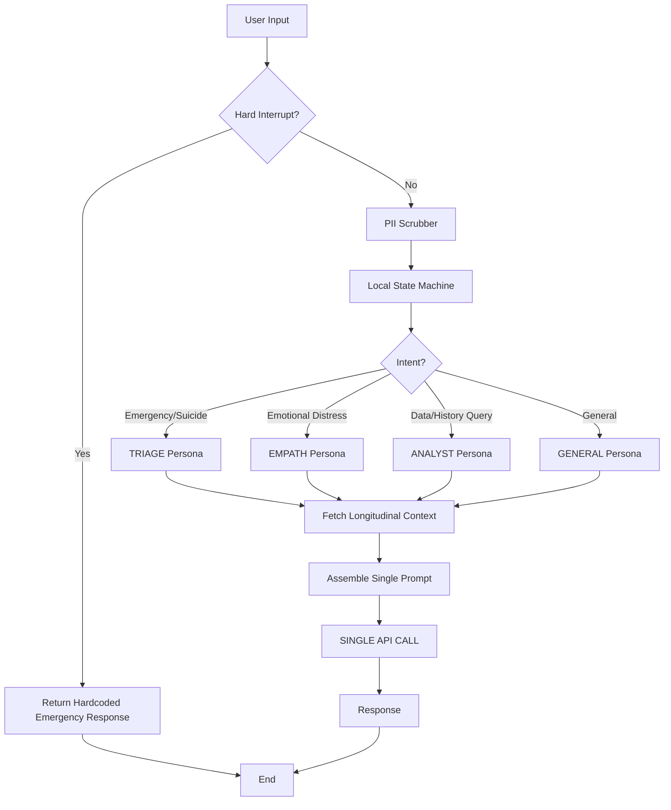

# PulseWeaver 🩺✨

> **The next-generation health AI that runs on a single API key.**  
> *Built by a small, slightly caffeinated team who believe you don't need a million agents to save lives.*

---

## 👋 Hey there, we're Team PulseWeaver

We're a stealth startup building health AI that actually works in the real world. Here's our constraint: **We have exactly ONE API key.** 

No multi-model routing. No expensive enterprise tiers. No AutoGen/LangGraph frameworks burning tokens on agent-to-agent chatter. Just **one shot** to get it right.

So we built **PulseWeaver**: A framework that uses local intelligence to route personas, inject longitudinal context, and hard-wire safety—*before* making that single, precious API call.

### The Philosophy
- **Local First:** Classification, safety checks, and memory happen on-device.
- **Token Efficiency:** Every token sent to the API counts. Zero waste.
- **Safety by Design:** Hard interrupts bypass the model entirely for emergencies.
- **Human Vibe:** Code written by humans, for humans. (Yes, there are TODOs with names attached.)

---

## 🏗️ Architecture: The Prism Pattern

We don't do "multi-agent swarms." We do **Prism Routing**.

1.  **User Input** hits our local engine.
2.  **Hard Interrupt Layer** scans for emergencies (suicide, chest pain). If matched → **BYPASS API**, return hardcoded emergency info.
3.  **PII Scrubber** sanitizes data locally (Elena's requirement).
4.  **State Machine** classifies intent locally (Regex/Heuristics) → Assigns Persona (`TRIAGE`, `EMPATH`, `ANALYST`).
5.  **Longitudinal Graph** fetches relevant history from SQLite.
6.  **Prism Router** assembles the **Single System Prompt** (Persona + Context + Disclaimers).
7.  **Single API Call** is made.
8.  **Response** returned to user.



---

## ⚖️ Legal & Ethics: Keeping Us Out of Court

This isn't just code; it's liability management.

### 🔴 Hard Interrupts
We **do not trust** the LLM to handle emergencies. Latency kills. Hallucinations kill. 
- Our `hard_interrupts.py` layer uses local regex to detect crisis keywords.
- If triggered, the API is **never called**. 
- The user gets immediate, vetted emergency numbers (911, 988, etc.).
- **Zero tokens spent. Zero latency. 100% deterministic.**

### 🔒 Zero-Knowledge Memory & PII
- **PII Scrubber:** Runs *before* the prompt leaves the device. Names, phones, MRNs are replaced with `[NAME]`, `[PHONE]`. 
- **Local Graph:** Health history stays in a local SQLite DB. We only inject *relevant* snippets into the context window, not the whole life story.
- **Compliance:** Designed with HIPAA principles in mind (though consult your own lawyer, please).

---

## 📂 Project Structure

```text
pulseweaver/
├── __init__.py
├── state_machine.py       # Local intent classifier (Regex/Heuristics)
├── prism_router.py        # The core: Assembles prompt & makes 1 API call
├── health_graph.py        # SQLite longitudinal memory
├── pii_scrubber.py        # Elena's baby: Regex PII redaction
├── hard_interrupts.py     # Safety layer: Bypasses API for emergencies
├── dynamic_disclaimers.py # Injects legal disclaimers into prompts
├── legal_config.json      # Patterns & disclaimer rules
├── docs/
│   └── architecture_phase1.md
└── tests/
    ├── test_interrupts.py
    └── test_scrubber.py
```

---

## 🚀 Getting Started

Ready to run the engine? 

### Prerequisites
- Python 3.9+
- `sqlite3` (built-in)
- Your single API key (set as env var)

### Installation

```bash
# Clone the repo
git clone https://github.com/stealth-pulseweaver/pulseweaver.git
cd pulseweaver

# Install deps (minimalist, remember?)
pip install -r requirements.txt

# Set your key
export PULSE_API_KEY="sk-your-single-key-here"

# Run the core engine
python -m pulseweaver.main
```

### Quick Test
```python
from pulseweaver.prism_router import PrismRouter

router = PrismRouter()
response = router.process("I've been feeling really down lately...")
print(response)
```

---

## 🛠️ Known Issues & TODOs (Real Talk)

Look, we're shipping fast. Here's where the bodies are buried:

- **[BUG] PII Scrubber False Positives:** Currently flags "Mass General" as a location and redacts it. David is working on a whitelist exception for major hospital names. *Workaround: None yet.*
- **[PERF] Empath Persona Token Bloat:** The `EMPATH` persona tends to be overly verbose with pleasantries ("I hear you," "That sounds tough"). It's eating 15% of our context window. *TODO: Sarah, trim the empathetic preamble templates.*
- **[EDGE CASE] State Machine Ambiguity:** If a user says "My chest hurts but I'm joking," the regex might still trigger TRIAGE. We need a "negation detector" layer. *Priority: High.*
- **[TECH DEBT] Persona Dictionary:** The persona definitions in `prism_router.py` are getting huge. Needs a refactor into separate YAML files. *Owner: Alex.*
- **[LEGAL] Disclaimer Overload:** In complex queries, we sometimes inject 3 different disclaimers, making the prompt unreadable. Need a priority ranking system.

---

## ⚠️ MEDICAL DISCLAIMER

**PulseWeaver is a software framework, NOT a medical device.**

- This code is provided "AS IS" for research and prototyping purposes.
- It **does not** provide medical advice, diagnosis, or treatment.
- The "Hard Interrupt" system is a safety feature, not a guarantee of care.
- **ALWAYS** consult a qualified healthcare professional for medical concerns.
- By using this software, you agree that Team PulseWeaver, its founders, and contributors are **not liable** for any damages, misdiagnoses, or delays in care resulting from its use.

---

## 📄 License

MIT License © 2026 Team PulseWeaver. 

*Go build something that matters.* ❤️‍🩹
