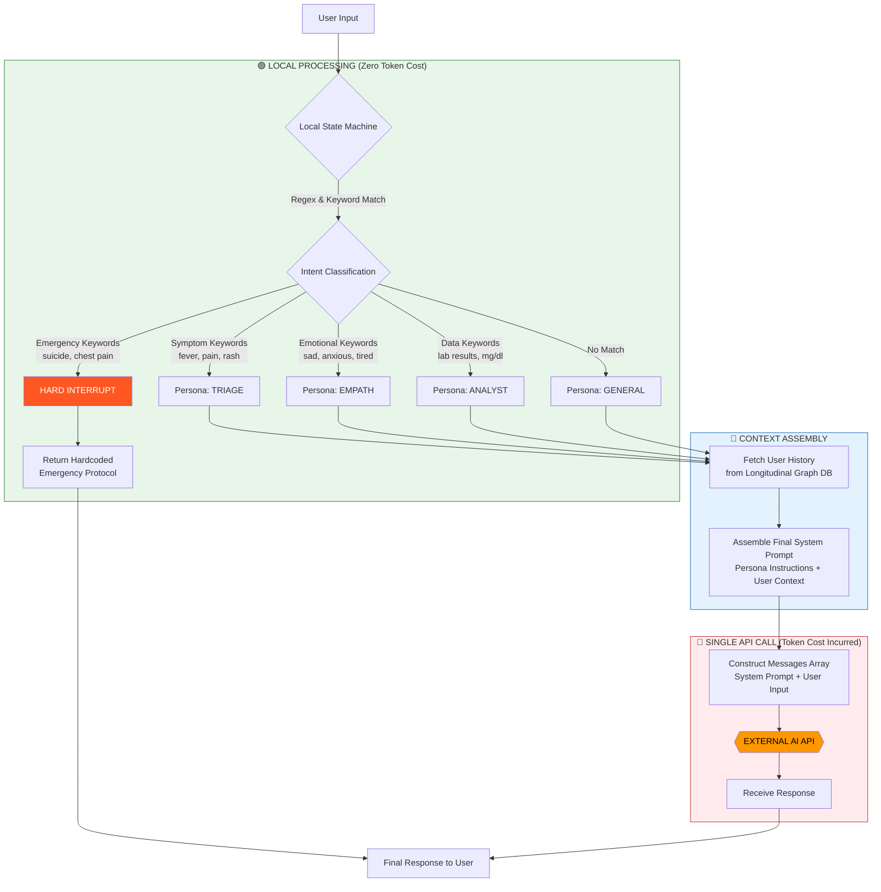

# PulseWeaver Architecture: Phase 1 (Prism Router)

## Flow Diagram

## Key Metrics

| Stage | Token Cost | Latency | Purpose |
|-------|-----------|---------|---------|
| **State Machine** | 0 | <5ms | Classify intent locally using regex |
| **Hard Interrupt** | 0 | <10ms | Return emergency info without API call |
| **Context Fetch** | 0 | ~50ms* | Retrieve user history from local DB |
| **API Call** | $$$ | ~1-3s | Single LLM inference with injected persona |

*\*Will be faster with proper indexing in Phase 2*

## Design Decisions

1. **Why Local Regex?** 
   - Alex: "We can't afford to burn tokens on classification. Regex is free and deterministic."

2. **Why Hard Interrupts?**
   - Legal requirement: Emergency responses must be immediate and vetted, not hallucinated by an LLM.
   - Saves money: Zero token cost for life-saving protocols.

3. **Why Single Persona Injection?**
   - Jamie: "Multi-agent frameworks like AutoGen are cool, but they chat with each other. That's 10+ API calls per user message. We do ONE."

## TODOs & Known Issues

- [ ] **David**: Move regex patterns to config file for hot-reloading
- [ ] **Sarah**: Expand keyword lists based on beta user logs
- [ ] **Alex**: Implement sliding window for context injection (token limit concerns)
- [ ] **Jamie**: Add retry logic with exponential backoff for API calls
- [ ] **Team**: REAL TALK - The General persona fallback needs better handling for out-of-domain queries
